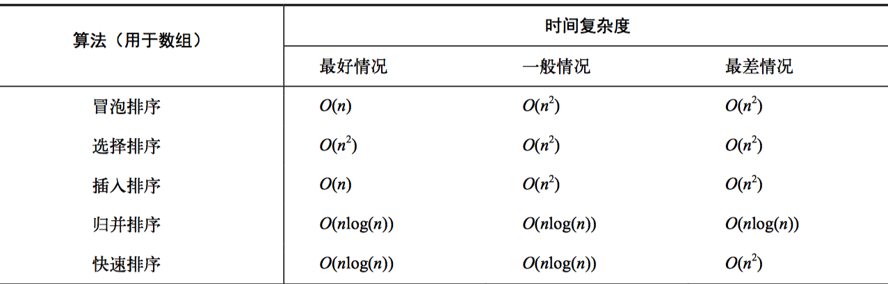

# **算法目录**

​		一直想要把算法知识总结一遍，奈何自己太懒，知道的一些基本算法也是零零散散，也不熟悉算法相关的的一些基础概念，这个系列就从入门到基础调理一遍，方便以后装逼。

### 算法的概念(Algorithm)：

​		算法是完成一个任务所需的一系列步骤，字面上理解就是算出某种东西的方法。

​		这里还要理解另一个名词--数据结构。不同的数据结构可能会对应不同的算法，两者之间有着相辅相成的关系

### 为什么学习算法？

​		根本上是可以提升自己对编程的理解，能够写出更好的代码，在平时实现工作中会写很多业务逻辑的代码，大多数情况下中级工程师，高级工程师甚至初级工程师都能完成任务，但有些时候，任务完成的好坏，程序运行的性能好坏却是不同的。好的算法可能会让程序运行效率高很多。

### 数据结构：

- [数据结构](./数据结构.md) 
- 常见数据结构
  1. [数组](./数据结构.md#数组)
  2. [栈](./数据结构.md#栈)
  3. [队列](./数据结构.md#队列)
  4. [链表](./数据结构.md#链表)
  5. [树](./数据结构.md#树)
  6. [图](./数据结构.md#图)

- 常见排序算法
  1. [冒泡排序](./常见排序算法/冒泡排序/冒泡排序.md)
  2. [插入排序](./常见排序算法/插入排序.md)
  3. [选择排序](./常见排序算法/选择排序.md)
  4. [归并排序](./常见排序算法/归并排序.md)
  5. [快速排序](./常见排序算法/快速排序.md)

### 递归:

​	递归就是调用自身

​	递归一般需要注意跳出递归的时机和判断，否则容易造成循环溢出

### 分治：

​分而治之，指把大片的数据分割成小部分来处理，小部分之间相互没有关系，最后把小部分组合成大片的数据

### 动态规划：

​动态规划是将问题分解成相互依赖的子问题

### 时间复杂度：

指数与对数：

a的n次方等于b，那我们说以a为底b的对数等于n ，即loga b = n ；

如果底数为10，可以省略不写 log10 b = n  ==> log b = n

常用公式：loga MN = loga M + loga N; loga M/N = loga M - loga N;log a M N次方 = N loga M

算法有时间复杂度和空间复杂度

O(n) 使用大O表示时间复杂度  O即Operation(操作数)，一般取最高次项，所以时间复杂度就是指操作次数

通常说的算法效率指的是时间复杂度

排序算法复杂度：

为什么快速和归并 是 nlogn 呢，因为第一重循环n次，内部循环由于是折半，每次都需要 log2 n（以2为底n的对数）,简写logn

所以执行操作数为 n*logn，复杂度就为O(nlogn)

### 学习链接

[程序员必须掌握哪些算法](https://www.zhihu.com/question/23148377)

