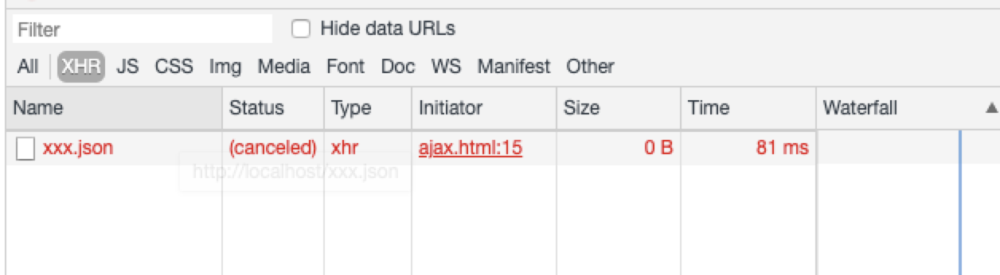

# Ajax 取消请求

关键字 abort (流产,夭折)

git 取消合并也是使用这个单词作为参数 git merge --abort

### 原生 xhr

原生 xhr 取消请求 使用 xhr.abort()取消请求

```
var xhr = new XMLHttpRequest();
xhr.open("GET","https://url/");
xhr.send();
xhr.onreadystatechange=function(){
    if(xhr.readyState==4&&xhr.status==200){
        console.log(xhr.response);
    }else{
        console.log(xhr.status);
    }
}
xhr.abort();
```

这时候在控制台 status 中看到熟悉的 canceled



### axios 如何取消请求

```
var CancelToken = axios.CancelToken;

var custom1 = CancelToken.source();
axios({
    method:"GET",
    url:"https://url/",
    cancelToken:custom1.token
}).then((res) => {
    console.log(res.data);
}).catch((err) => {
    console.log(err);
});

var custom2 = CancelToken.source();
axios({
    method:"GET",
    url:"https://url/",
    cancelToken:custom2.token
}).then((res)=>{
    console.log(res.data);
}).catch((err)=>{
    console.log(err);
});

custom1.cancel('取消1');
custom2.cancel('取消2');
```

源码分析:

1. 创建一个 CancelToken 实例
2. 执行 cancel 方法 传入 取消的 message 并赋值给 token.reason
3. 在 throwIfRequested 方法中 判断 token.reason 是否存在，如果不存在 throw promise 变成 reject 状态 axios 进入 catch
