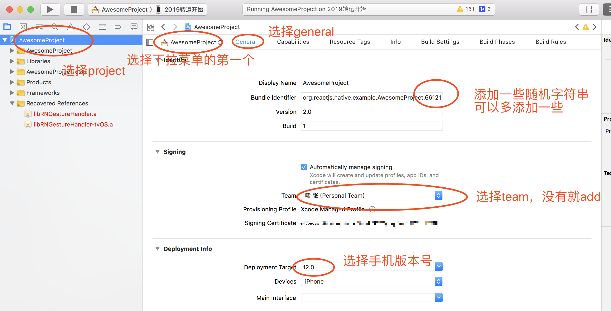
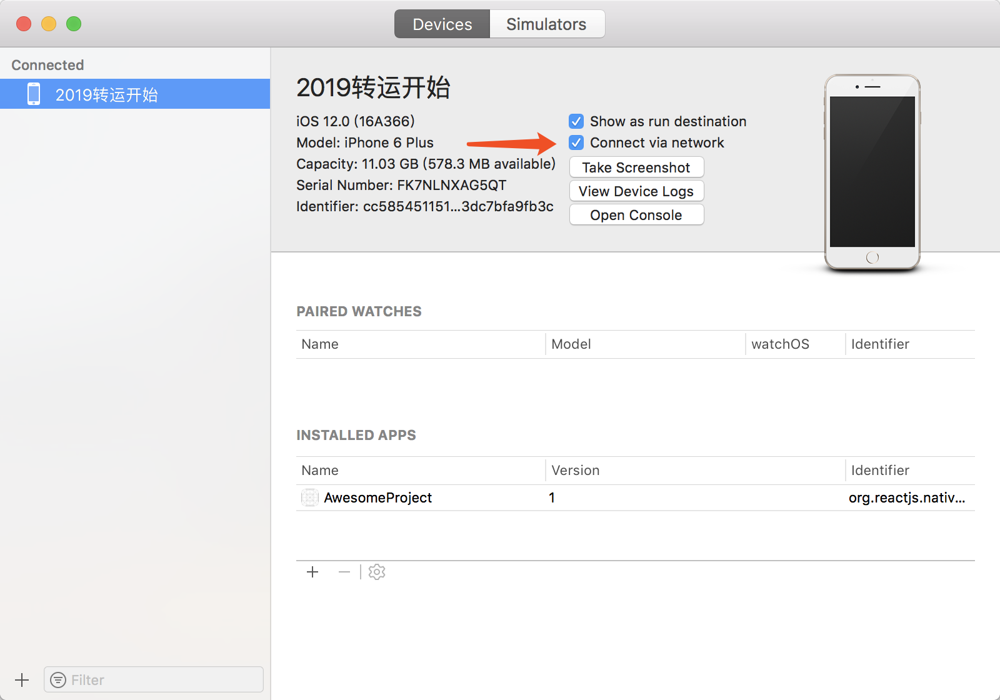

# Xcode真机调试

做完以上配置之后，插上手机

配置运行设备为 iphone（在运行按钮旁边选择）

点击运行，手机会安装app

如果有信任开发者的问题，在手机中 通用 > 设备管理 选择设备信任

关于网络问题，运行在手机之后可能会不断输出 网络链接failed的信息

是要设置 设备 如图打勾即可 面板呼出快捷键 shift+command+2

### 以上所有修改点，修改之后如果没反应的，都先重启Xcode试一下，印证了一句老话，重启可以解决95%的问题

