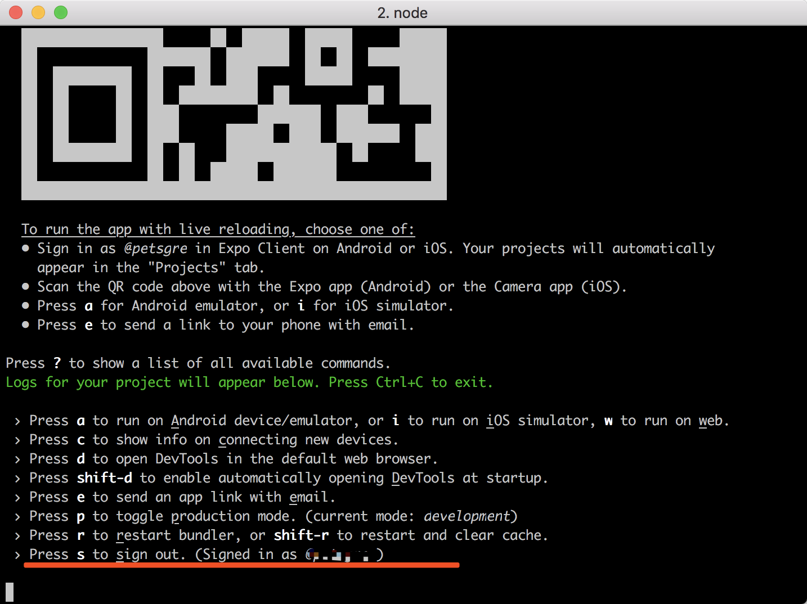
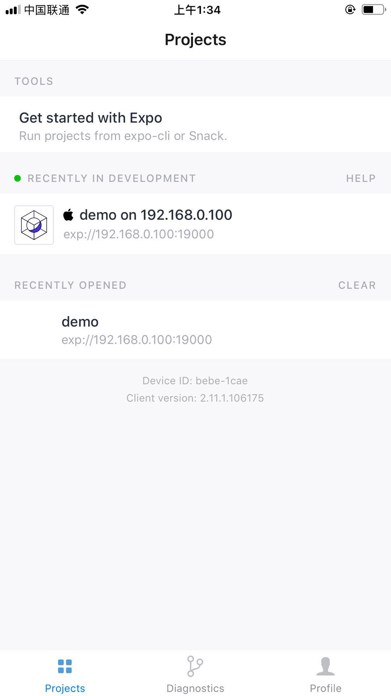

# React-native 开发流程

### 环境

- MacOS 10.13.6
- ios 11+


### 文档

- [React-native官方文档](https://facebook.github.io/react-native/docs/getting-started)


### 文档翻译

1. 利用expo-cli开发,执行如下命令，会出现控制台

expo-cli 代表 pc端的expo，通过terminal打开的命令需要登录



```
npm install -g expo-cli
expo init AwesomeProject

cd AwesomeProject
npm start # you can also use: expo start

```


2. 下载 expo客户端，可以通过这个客户端直接打开编译后的app，无需像传统ios开发一样重新打包安装，要登录，登录账号要和 pc端的expo一致


3. 2端的expo都登录之后，重新启动项目，会在客户端发现多了个project

   

4. 以上步骤出现说明环境搭建成功，接下来可以继续写application了
