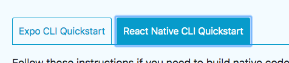
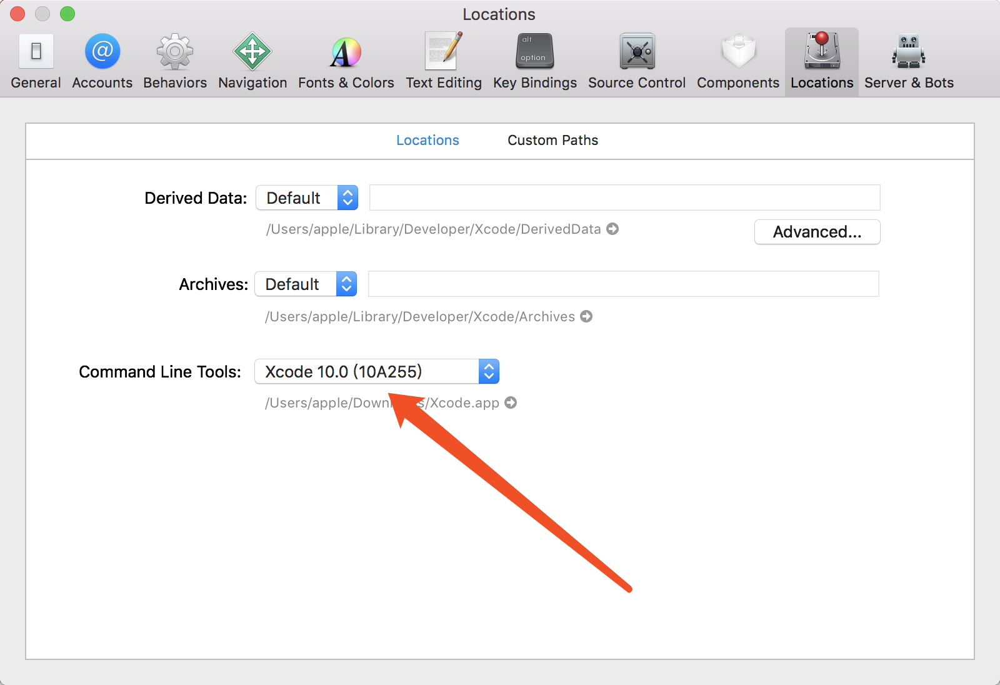

# React Native 完全构建方法流程


官方链接: [Getting Started](https://facebook.github.io/react-native/docs/0.59/getting-started)

这里推荐能看英文的就看英文的，中文毕竟翻译或者其他因素导致时间有延迟





使用原生模式快速开始

```
brew install node // node 10.0+
brew install watchman
```

安装脚手架

```
npm install -g react-native-cli
```

安装Xcode

这里要注意一下版本问题，Xcode比较大，别白下载了

Mac 10.13 最高可以安装 Xcode 10.0

安装完Xcode之后要添加。Commend Line Tools. 就是帮助react-native命令可以直接启动Xcode

修改路径在: Xcode > Perference > locations





初始化react native项目 

```
react-native init AwesomeProject --version react-native@next
```

初始化过程中要下载第三方依赖包，速度比较慢，根据 [中文版react-native]([http://bbs.reactnative.cn/topic/4301/ios-rn-0-45%E4%BB%A5%E4%B8%8A%E7%89%88%E6%9C%AC%E6%89%80%E9%9C%80%E7%9A%84%E7%AC%AC%E4%B8%89%E6%96%B9%E7%BC%96%E8%AF%91%E5%BA%93-boost%E7%AD%89](http://bbs.reactnative.cn/topic/4301/ios-rn-0-45以上版本所需的第三方编译库-boost等))说明下载需要的依赖包


使用yarn 比 npm快，yarn是 Facebook 提供的替代 npm 的工具，可以加速 node 模块的下载。


启动项目：

```
cd AwesomeProject
react-native run-ios
```

