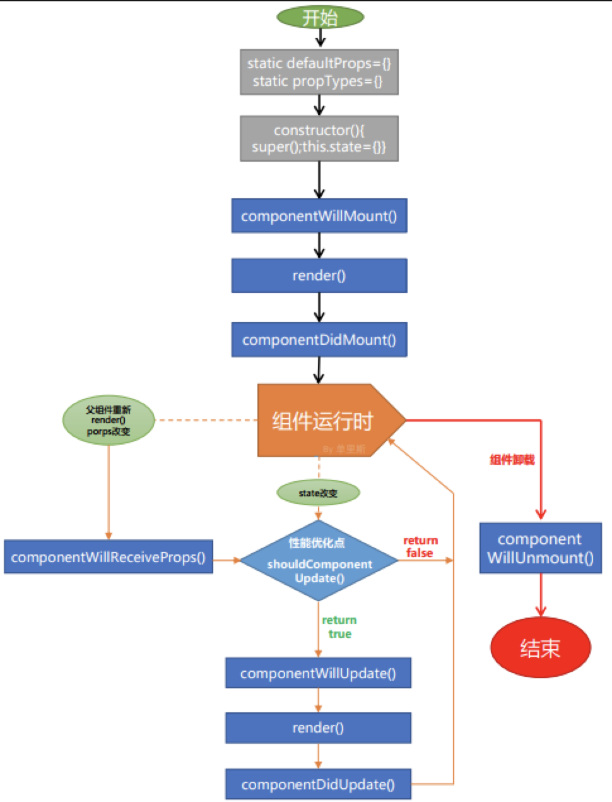

## react

<span style="color:red">不要在 render 函数里面使用高阶组件<span>

1. [react 脚手架-webpack](https://segmentfault.com/a/1190000019126657)
2. [使用 react-intl 实现 React 组件国际化](https://www.jianshu.com/p/574f6cea4f26)
3. [不要在 render 函数里面使用高阶组件](https://github.com/sunyongjian/blog/issues/25)
4. [react-router 配置 404 页面](./react/react-router配置404页面.md)
5. [Redux 书写习惯](https://segmentfault.com/a/1190000010915166)
6. [React 动态 import()](https://www.cnblogs.com/lantuoxie/p/9104014.html)
7. [React 中 this 值绑定和事件函数传参](https://juejin.im/post/5b4a96df5188251aa91da3cd)

### notes

1. React diff 优化

```
1. 暴力删除子节点，如果父节点变化了，子节点直接删除 并重新创建
2. 暴力删除子组件，如果父组件变化了(类型，结构)直接删除组件 并创建新组件
3. 根绝key判断，哪些节点需要drop，哪些需要move
```

2. React生命周期

 - componentWillMount
 - render
 - componentDidMount
 - shouldComponentUpdate
 - render
 - componentDidUpdate
 - componentWillUnmount




### React 性能优化:

1. 展示组件 PureComponent 代替 Component
2. 组件懒加载，懒加载需要注意过度效果，因为 js 要异步加载
3. React Fragments 避免额外标记
4. 避免 bind this，而是预先在 constructor 中定义
5. shouldComponentUpdate 中做一些逻辑来判断是否需要重新渲染
6. 可添加删除的列表不要使用 index 作为 key(可使用 shortid 生成简短 id)
7. gzip 压缩
8. 避免 ...props
9. 使用Reselect 避免重复渲染
10. 使用immutability-helper只更改需要更变的数据